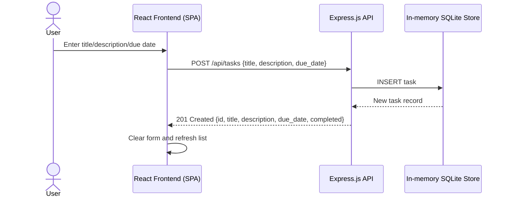

# Cloud Architecture Overview (System Context)

This monorepo contains a React frontend and an Express API backed by an in-memory SQLite store (via `better-sqlite3`).

```mermaid
flowchart LR
  user[End User] --> browser[React Frontend (SPA)]
  subgraph Monorepo
    direction LR
    subgraph Frontend (packages/frontend)
      browser
    end
    subgraph Backend (packages/backend)
      api[Express.js API Server]
      db[(In-memory SQLite Store)]
      api --> db
    end
  end
  browser --> api
```

Notes:
- Frontend: React app (MUI) served to the user's browser.
- Backend: Express.js API handling CRUD for tasks.
- Data: In-memory SQLite database initialized at runtime (non-persistent).

## Sequence: Create a TODO


