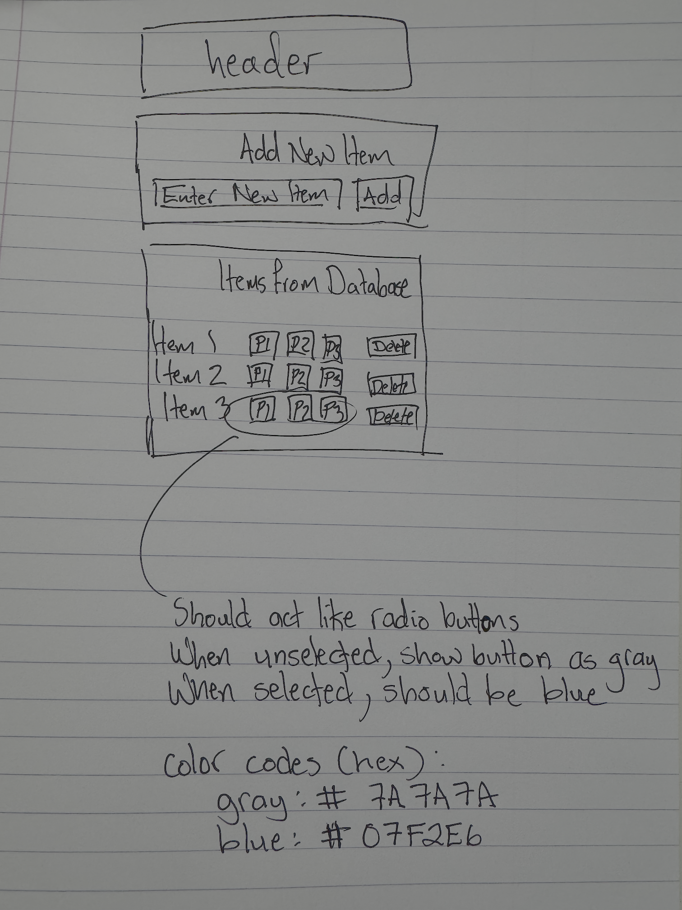

# Story: Add priority field with default P3

## Acceptance Criteria

- New tasks created without an explicit priority are stored with priority value "P3".
- Priority field supports only values "P1", "P2", "P3".
- Priority is displayed in the task list with color-coded badge per sketch (P1 red, P2 orange, P3 gray).

## Technical Requirements

- Extend task model to include `priority` alongside `title`, `description`, `due_date`, and `completed`.
- Backend `/api/tasks` must accept and return `priority` (default `P3` when absent) on POST/PUT.
- Frontend form includes a select dropdown constrained to P1/P2/P3 with default P3.
- Persist `priority` via API; render a badge in list with colors:
	- P1: red (#f44336)
	- P2: orange (#ff9800)
	- P3: gray (#9e9e9e)
